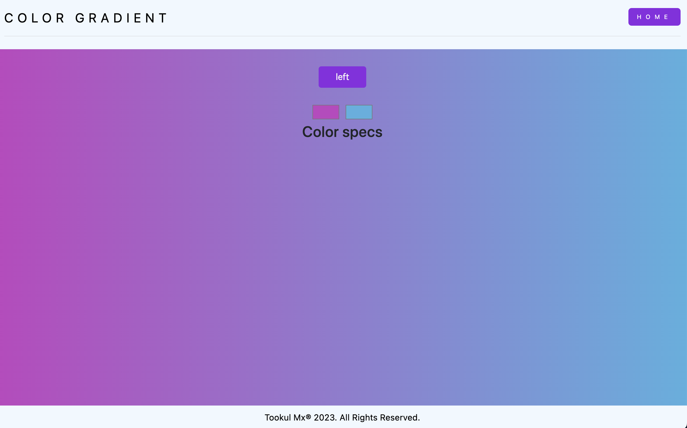

# Background generator

This background generator, made with Bootstrap and JavaScript, lets you create custom gradient backgrounds by choosing your favorite colors. It's an easy and effective way to see and preview different gradient patterns for your projects. Plus, it gives you the CSS code so you can easily add the gradient to your own code.

